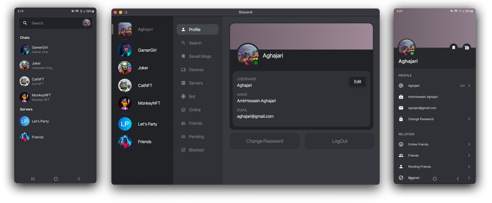
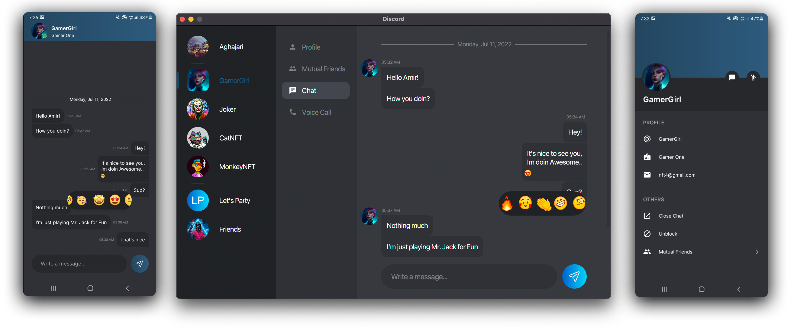
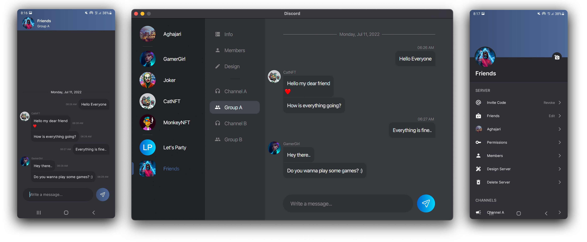
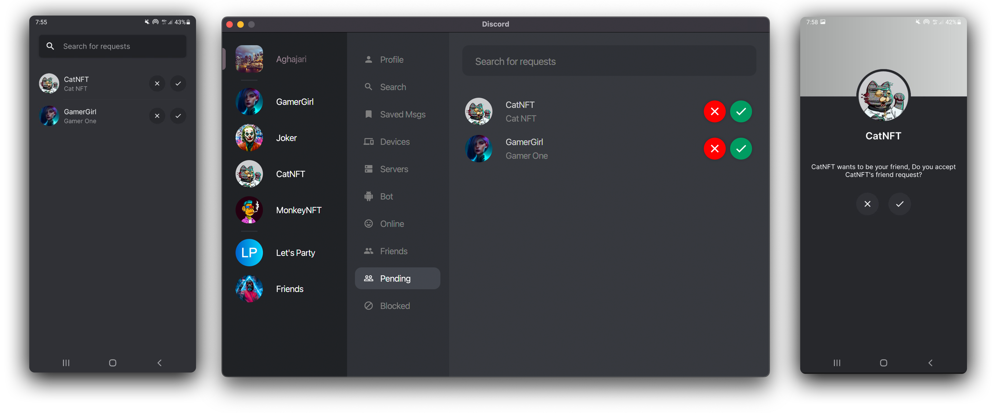
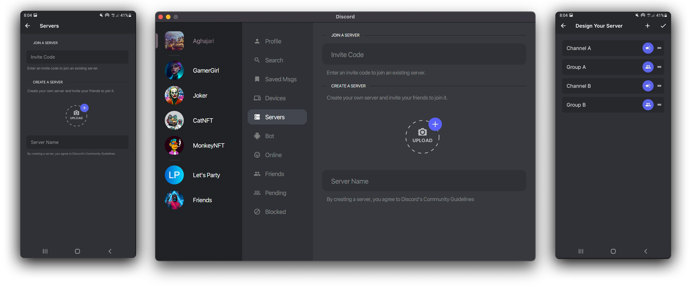
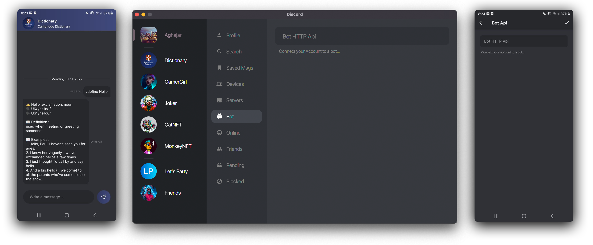
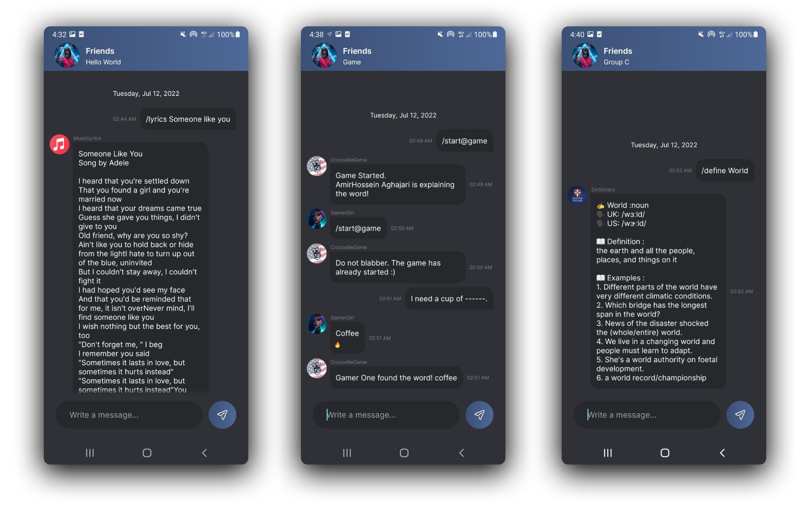

# AP-FinalProject
 A secure messaging social platform based on Discord for Desktop and Android.<br>
This is my final project for Advanced-Programming (AP) in Amirkabir University of Technology (AUT).<br>



**Technologies Used:**<br>
- **JavaFX** for Desktop GUI
- **Java** for Android
- **Java** for Socket And ServerSocket
- **Node.js** for Rest API
- **PHP** for Sample Bots
- **MongoDB** And **MySQL** for Database

**Libraries Used:**<br>
- [XmlByPass](https://github.com/Aghajari/XmlByPass) (Android)
- [AXAnimation](https://github.com/Aghajari/AXAnimation) (Android)
- [AXrLottie](https://github.com/Aghajari/AXrLottie) (Android)
- [Retrofit](https://github.com/square/retrofit) (All)
- [Gson](https://github.com/google/gson) (All)
- [ZXing](https://github.com/zxing/zxing) (Desktop)
- [MaterialFX](https://github.com/palexdev/MaterialFX) (Desktop)
- [Mongoose](https://github.com/Automattic/mongoose) (Node.js)
- [jsonwebtoken](https://github.com/auth0/node-jsonwebtoken) (Node.js)


**Video:**<br>
https://user-images.githubusercontent.com/30867537/179339193-f0e99cfe-18a3-49b1-8175-c14edad66437.mp4

[This video](./video.mp4) shows the performance of the application in both Android and desktop versions.<br>
It also displays smooth animations.

**Desktop:**<br>
The desktop version has been tested on Mac (OS X) and Windows (10)<br>

**Android:**<br>
The Android version is written in Java,<br>
I tested [XmlByPass](https://github.com/Aghajari/XmlByPass) in this project and it came out proud

**Port:**<br>
- **Api** (Node.js) runs on `3154` by default.<br>
Change `port` in [.env](Server/Api/.env)<br>
Make sure to change port of `API_ADDRESS` in `ApiService.java` too.<br>
- **ServerSocket** runs on `2424` by default.<br>
Change `SERVER_PORT` in `ApiService.java` [Server](./Server/DiscordServer/src/main/java/com/aghajari/api/ApiService.java), [Desktop](./Desktop/Discord/src/main/java/com/aghajari/api/ApiService.java), [Android](./Android/Discord/app/src/main/java/com/aghajari/api/ApiService.java)

**Installation:**<br>
- Api (Node.js)
  + Replace `YOUR-DOMAIN.com` with your domain address in [.env](Server/Api/app.js)
  + Change `jwt_secret` in [.env](Server/Api/.env) (Something random and secure)
  + Install npm packages: `npm install`
  + Run project: `node app.js`

- Server
  + Install [MySQL](https://dev.mysql.com/downloads/mysql/)
  + Import [database.sql](./Server/database.sql) to MySQL
  + Replace address of api with `API_ADDRESS` in [ApiService.java](./Server/DiscordServer/src/main/java/com/aghajari/api/ApiService.java)
  + Run [Project](./Server/DiscordServer)
  
- Desktop
  + Replace address of api with `API_ADDRESS` in [ApiService.java](./Desktop/Discord/src/main/java/com/aghajari/api/ApiService.java)
  + Replace address of socket with `SOCKET_IP` in [ApiService.java](./Desktop/Discord/src/main/java/com/aghajari/api/ApiService.java)
  + Set yor os type in [pom.xml](./Desktop/Discord/pom.xml). `<os>?</os>` : `mac`, `linux`, `win` and `win-x86`
  + Run [Project](./Desktop/Discord)
  
- Android
  + Replace address of api with `API_ADDRESS` in [ApiService.java](./Android/Discord/app/src/main/java/com/aghajari/api/ApiService.java)
  + Replace address of socket with `SOCKET_IP` in [ApiService.java](./Android/Discord/app/src/main/java/com/aghajari/api/ApiService.java)
  + Run [Project](./Android/Discord)
  
## Chat Page
These are some screen shots of PrivateMessage and Server's GroupChat.<br>
Reactions are lottie animations from telegram emoji set.

<br>


## Voice Call
Voice call over socket tcp connection (i'll replace it with VoIP soon...)


## Friendship
Send friendship request, block your enemies :D, Chat with your online friends.



## Servers
Join a server if you have an invite code, <br>
Create a server and design channels & groups then invite your friends to start a party!<br>
Manage permissions of each member in your server.



## Login By QRCode
You can login or signup in normal way in both desktop and android <br>
You can also link your authorized android account to the desktop by scanning a QRCode!


## Bot
Connect your account to a bot. (Only for developers) <br>
A bot is only an HTTP api link, You can develop the api in all programming languages.





This one is a "Hello World!" bot code written in PHP.<br>
```PHP
<?php
header("Content-Type: application/json");

$data = json_decode(file_get_contents('php://input'));

echo json_encode([
    "to"=>$data->chatId, 
    "text"=>"Hello World!"
]);

?>
```

[See more...](./Bot)

<details><summary><b>Bot Api Document</b></summary>
<p>

|Field|Type|Description|
| :---------------- | :----------------: | :---------------- |
| chatId | String | Unique identifier for this chat |
| from | User | Sender of the message |
| to | User | Receiver of the message, if receiver is a user |
| server | Server |  Server details, if receiver is channel of a server |
| channel | Server.Channel | Receiver of the message if is channel of a server |
| isPrivateMessage | Boolean | True, if receiver is a user |
| message | Message | Information about the message |

<b>User</b>
|Field|Type|Description|
| :---------------- | :----------------: | :---------------- |
| avatar | String | User's avatar link |
| username | String | User's user name |
| nickname | String | User's nick name |
| email | String | User's email address |
| isOnline | Boolean | True, if user is online |
 
<b>Server</b>
|Field|Type|Description|
| :---------------- | :----------------: | :---------------- |
| id | String | Server's unique id |
| name | String | Server's name |
| avatar | String | Server's avatar link |
| channels | Array of Server.Channel | List of all channel and groups in this server |
 
<b>Server.Channel</b>
|Field|Type|Description|
| :---------------- | :----------------: | :---------------- |
| id | String | Channel's unique id |
| name | String | Channel's name |
| type | Integer | 0 if is a channel, 1 if is a group |
 
<b>Message</b>
|Field|Type|Description|
| :---------------- | :----------------: | :---------------- |
| text | String | Message's text |
| time | Integer | Date the message was sent in Unix time |
| fromId | String | Id of sender of this message |
| toId | String | Id of receiver of this message |
 
</p></details>
